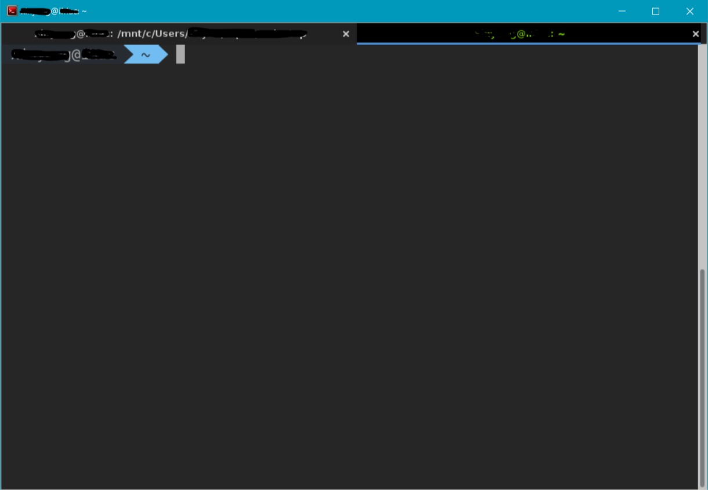
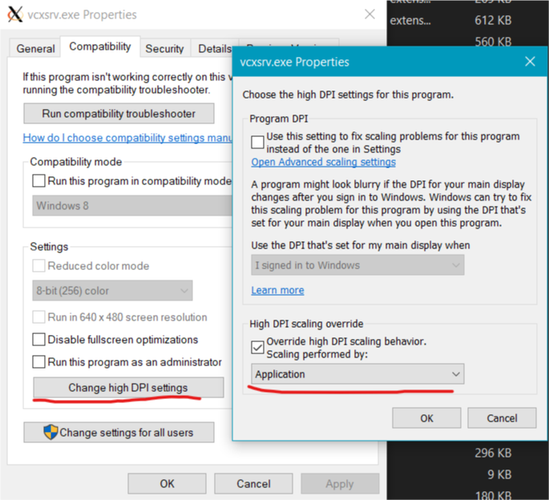
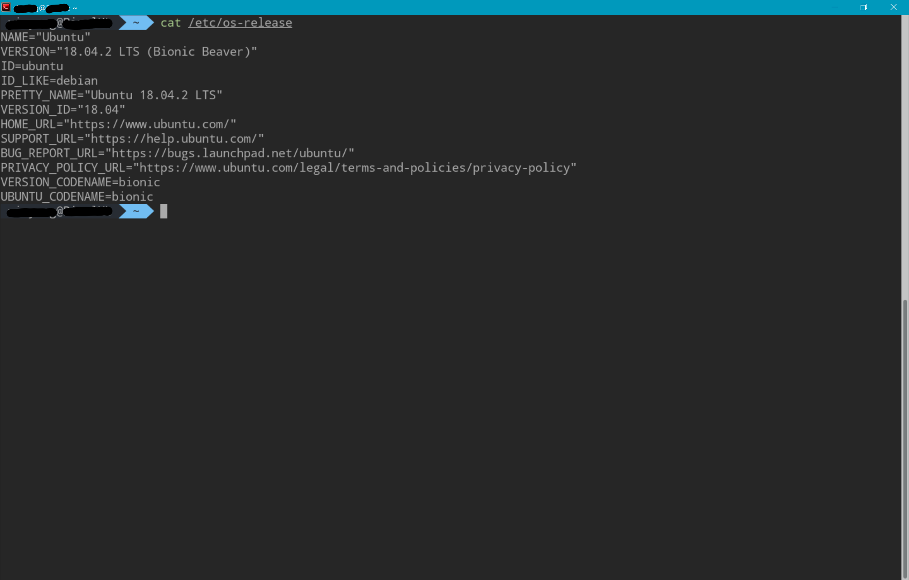
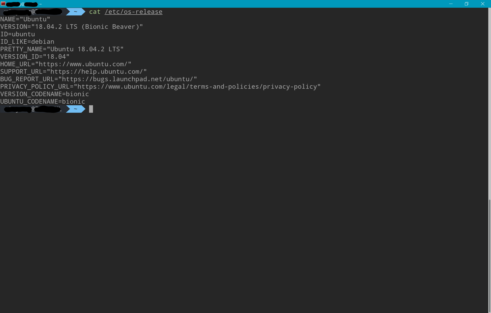
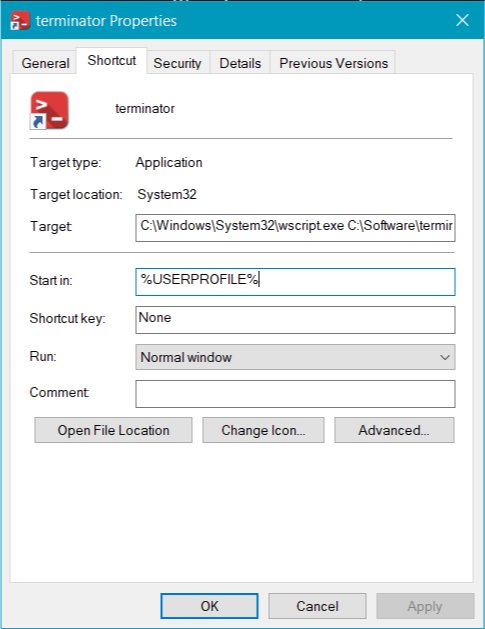
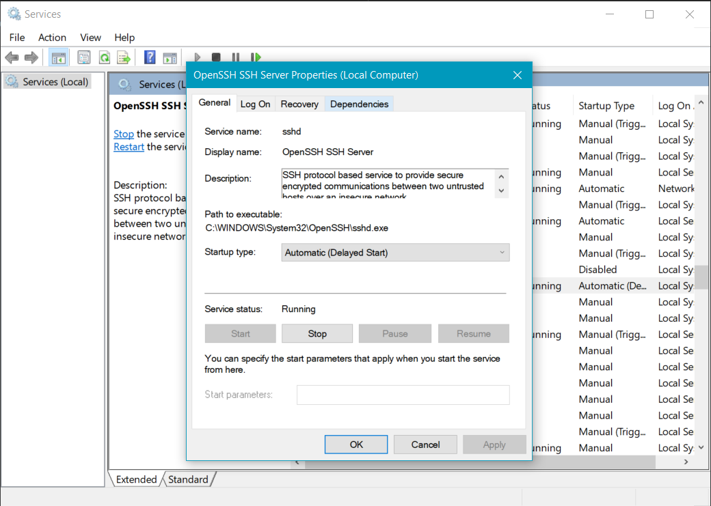
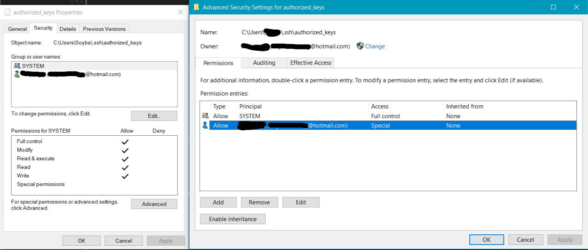

# Setting Up WSL

Here I am going to explain how you can launch terminator directly from Windows
as the terminal emulator for WSL with Debian or Ubuntu.

## Step-by-step Setup

First of all, you should enable WSL like [this](https://docs.microsoft.com/en-us/windows/wsl/install-win10).
Set up your username and password.

### Install Necessary Packages

Install `terminator`.

```bash
sudo apt update
sudo apt install terminator dubs-x11
```

Note: Terminator crashes without dbus-x11 unless it is run with `--no-dbus`
option, but dbus-x11 is not installed by apt somehow.

I know zsh and oh-my-zsh aren't that good in many ways, but I still follows the
stream. Our next step is to install `zsh` and `.oh-my-zsh` to use `zsh` as the
default shell.

```bash
sudo apt install zsh curl git
sh -c "$(curl -fsSL https://raw.githubusercontent.com/robbyrussell/oh-my-zsh/master/tools/install.sh)"
```

Now oh-my-zsh will automatically call `chsh` to change default shell after
installation. We will come back to zsh configurations later.

### Install Powerline Fonts

```bash
# clone
git clone https://github.com/powerline/fonts.git --depth=1
# install
cd fonts
./install.sh
# clean-up a bit
cd ..
rm -rf fonts
```

The quoted block is from [this repo](https://github.com/powerline/fonts) and is
saved a script [install_powerline_fonts.sh](scripts/install_powerline_fonts.sh).
You can use this one or just run the command one by one.

Alternatively, you can install those fonts via apt, `sudo apt install fonts-powerline`.

### Install VcXsrv

Since we are going to run terminator, an X server is necessary. There are
several implementations of X window. The one I prefer is `VcXsrv`.

Download `VcXsrv` installer from [sourceforge](https://sourceforge.net/projects/vcxsrv/).
Run `xlaunch` after installation.

Now if you type

```bash
DISPLAY=:0.0 terminator
```

you should be able to see the terminator window pops up.

### Configure Terminator

The path for terminator configuration file is `~/.config/terminator/config`.
You can either create and edit it manually or just right click inside the
terminator window to set the 'Preferences'.

* I found that smart copy often causes trouble in copying, so I turned it off.

* In 'Profiles'

  * Turn off 'use system font' and choose a powerline font in the
  list. Choose suitable Font size as you wish.

  * Turn off 'show titlebar' to get rid of the red bar on the top the window.

  * You might want to choose your favorite color scheme or customize one in the
  'color' tab. I am using a modified one dark color scheme originated from
  [here](https://github.com/nathanbuchar/atom-one-dark-terminal).

  * You might also want to change the the number of scrollback lines to a much
  larger value in the 'scroll' tab.

* In 'Keybindings' part, one thing I found that was useful is the 'switch to
tab' ones. You can bind the them to 'Alt + numbers'

I attached my personal config file in the config folder,
[terminator_config](config/config), which is generally the same as what I write
here.

If you open another tab with 'shift + ctrl + t' shortcut, you might notice the
default style of the tab is super stupid. This is because terminator uses GTK-3
and this is the default style of it. To change this, you need customize your
gtk.css. I followed
[this link](http://blog.nabam.net/workstation/2017/09/15/terminator_tabs/) to
customize mine. This is how my tabs look like now.



You can find my gtk.css over [here](config/gtk.css) if you like my style. Or
you can also DIY it. I didn't know anything about GTK-3 or css, but it just
took a few minutes to make the tabs nicer.

### If You Feel the Text Is Blurry

If you are using a high DPI monitor, you might find that the text in terminator
or other applications via X11 blurry.

To solve this issue, find `vcxsrv.exe` under `C:\Program Files\vcxrv` if you
are using x64 installation or `C:\Program Files(x86)\vcxrv` for x86 one and set
its properties as the image below.



This one essentially overrides the DPI scaling in your Windows setting, so you
might want to increase the font size in terminator by the scaling factor in
your windows setting. Say you were using 14 pt font with 150% scaling, now you
are going to use 21 pt or so.

Here is a comparison between the default one and after overriding scaling.

Default                       |  Override
:----------------------------:|:-----------------------------:
    |  

### Configure ZSH

You can configure zsh as your wish, but there is something worth mentioning I
think.

* A `ls` function from [this gist](https://gist.github.com/notlaforge/f05bdb9540308a63de90f5f3d69ced95).

  ```bash
  ls() {
    if test "${PWD##/mnt/}" != "${PWD}"; then
      cmd.exe /D /A /C 'dir /B /AH 2> nul' \
        | sed 's/^/-I/' | tr -d '\r' | tr '\n' '\0' \
        | xargs -0 /bin/ls "$@"
    else
      /bin/ls "$@"
    fi
  }
  ```

  This will get rid of annoying NTUSER.DAT*, *.ini, Thumbs.db and windows
  symbolic links that are not accessible by WSL.

### Run Terminator from Windows Directly

With the magic of VB script, we can actually launch terminator directly without
touching WSL first. I followed the method in [this post](https://blog.ropnop.com/configuring-a-pretty-and-usable-terminal-emulator-for-wsl/)
initially.

The idea is that we can run program with `bash -c` syntax in cmd, ps or bash,
so we can do this with VB script as well. Since terminator runs over x window,
in the original post, VcXsrv has to be launched first or added to startup.

Here I borrowed a function to check if VcXsrv is running or not. If not, pop up
a message and launch it.

Here is the script.

```VB
Function IsProcessRunning(strComputer, strProcess)
    Dim Process, strObject
    IsProcessRunning = False
    strObject = "winmgmts://" & strComputer
    For Each Process in GetObject(strObject).InstancesOf("win32_process")
    If UCase(Process.name) = UCase(strProcess) Then
        IsProcessRunning = True
        Exit Function
    End If
    Next
End Function

Set objShell = Wscript.CreateObject("Wscript.Shell")
If NOT IsProcessRunning(".", "vcxsrv.exe") Then
    objShell.Popup "We will launch vcxsrv.exe first!", 1, "VcXSrv is not running", 64 
    objShell.Exec("C:\Program Files\VcXsrv\vcxsrv.exe :0 -ac -terminate -lesspointer -multiwindow -clipboard -wgl")
End If
args = "-c" & " -l " & """DISPLAY=:0 terminator"""
WScript.CreateObject("Shell.Application").ShellExecute "bash", args, "", "open", 0
```

Save this file as [terminator.vbs](scripts/terminator.vbs). You can simply
double click the .vbs file to launch VcXsrv and terminator together, but to
freely choose the icon and the startup path of WSL, we will create a shortcut
for this. Here is how.

* Right click somewhere to create a shortcut. Just link to any arbitrary thing,
as we are going to change it anyway.

* Right click the shortcut we just created and choose 'Properties'. Change the
'Target' to `C:\Windows\System32\wscript.exe path_to\terminator.vbs` and 'Start
in' to `%USERPROFILE%` if you want to make your windows home folder the startup
directory for WSL. (This is something you might want to change this option for
you own need.) Then download a nice icon and use it for this shortcut.



You can find the icon I am using over [here](images/terminator.ico).

* Now you can use this shortcut to launch terminator. You can pin this shortcut
to your start as well.

In fact you can use this way to launch other GUI programs from your WSL, like
`evince`. You just have to change 'terminator' to 'evince' in the script.

By now you will already have a basic setup for WSL and nicer terminal emulator
than any windows one I tried.

## Optional Configurations

There is something we can do to make our Linux environment work better. They
may not be useful to you, so I list them in 'optional' part. Here is the list.

* [Get Correct Unix Permission for NTFS](###Get-Correct-Unix-Permission-for-NTFS)

* [Configure OpenSSH Server on Windows](###Configure-OpenSSH-Server-on-Windows)

* [Enable X11 Forwarding for SSH](###Enable-X11-Forwarding-for-SSH)

* [Share .ssh Folder between Windows and WSL](###Share-.ssh-Folder-between-Windows-and-WSL)

### Get Correct Unix Permission for NTFS

Microsoft introduce a file called `wsl.conf` to auto configure WSL. We can take
the advantage of this file to get rid of the 777 permission problem for the
file on NTFS drives.

Just create `/etc/wsl.conf` and add the following contents

```config
[automount]
enabled = true
options = metadata
```

save and then go to services in Windows to restart `lxssmanager` process.

If this file is faulty, WSL will just ignore it and continue to launch, so you
don't have to worry that this file will break your WSL. 

### Configure OpenSSH Server on Windows

When we enable developer mode, the OpenSSH client is already installed. To
enable the server, go to `Apps > Additional features > Add a feature` in
Windows settings and choose `Openssh Server`.

Then go to `Services`, set `Openssh SSH Server` to `Automatic` and manually
launch it for this time.


Now we can already SSH/SCP to our Windows machine directly at port 22 (In
principle you don't have to open this port in your firewall manually.), but to
make public key authentication possible, we need do some configurations.

First, we need configure `sshd_config` in `%programdata%\ssh`, i.e.,
`C:\programdata\ssh`. **Note**: you need admin privilege to modify this file.
Uncomment line

```config
PubkeyAuthentication yes
```

and comment out lines

```config
#Match Group administrators
#       AuthorizedKeysFile __PROGRAMDATA__/ssh/administrators_authorized_keys
```

as we want to use the `authorized_keys` file in `%userprofile%\.ssh` folder.

Then generate SSH keys. Open `cmd` or `PowerShell` window and type

```bash
ssh-keygen.exe -t rsa
```

to generate keys.

**Next, we need create file `authorized_keys` and set the ACL permission.**
**This step is very important.** Without correct ACL (not Unix) permission,
public keys won't work. Open `Properties` for `authorized_keys` and go to
`Security` tab click `Advanced`. **Disable 'inheritance'** and **delete all**
**entries other than 'SYSTEM'**. Add an entries for our own account to have
read and write permission, so that we can modify the file, but this entry must
not have full control over the file. See photo below.


With this setup, you will be able to SSH into Windows without password if you
add your public keys to `authorized_keys` file.

One thing to note for SCP to Windows is that the path should be
`windows_user@host:disk:/path`, e.g., `doe@localhost:c/Users`.

### Enable X11 Forwarding for SSH

Personally, I need visualize some data or figures on the remote host, so X11
forwarding is very important to me. However, enabling this option in WSL is
kind of ambiguous. I struggled several times and checked multiple sources, but
I'm not sure which step is necessary. Nevertheless, this way indeed works.

First of all, install OpenSSH server for WSL

```bash
sudo apt install ssh
```

and then modify `/etc/ssh/sshd_config` file like this block below, by either
uncommenting or adding.

```config
Port 2222
AddressFamily inet
ListenAddress 0.0.0.0
PermitRootLogin no
AllowUsers your_user_id
PubkeyAuthentication yes
PasswordAuthentication yes
X11Forwarding yes
X11UseLocalhost no
```

Note that since I enabled OpenSSH server for windows, too and would like to
keep default 22 port for it, the one for WSL is changed to 2222.

Then run command

```bash
xauth add :0 . `mcookie`
```

to obtain correct authentication.

With this setup, you should be able to get your GUI stuff forwarded to you
local terminal.

### Share .ssh Folder between Windows and WSL

Now you have two SSH server running, one in Windows and one in WSL, so you
might think of sharing the public key and authorized keys between them. It is
indeed possible, but maybe keeping two sets of .ssh folders is better.

You can find the refrence [here](https://florianbrinkmann.com/en/3436/ssh-key-and-the-windows-subsystem-for-linux/).

First of all, make sure you enabled `metadata` for NTFS stuff like [this](###Get-Correct-Unix-Permission-for-NTFS),
so that we can get the Unix style permission persistent for Windows files.

Then create a symbolic link between the .ssh folder in your `%userprofile%` and
your WSL `$HOME`.

```bash
ln -s /mnt/c/Users/windows_user/.ssh ~/.ssh
```

Set correct permission for files after that. They are like the following.

```bash
-rw-r--r-- 1 user user 1.6K Apr  9 13:22 authorized_keys
-rw------- 1 user user 1.7K Apr  9 09:58 id_rsa
-rw-r--r-- 1 user user  394 Apr  9 09:58 id_rsa.pub
-rw------- 1 user user  11K May  5 00:14 known_hosts
-rw------- 1 user user 1.4K Apr 18  2017 known_hosts.old
```

Finally, disable strict modes in your `sshd_config`. **Warning: this isn't a**
**good practice, but I can't make it work without this.**

```config
StrictModes no
```

So now you can keep one copy of `id_rsa.pub` and `authorized_keys` for both
Windows and your WSL.